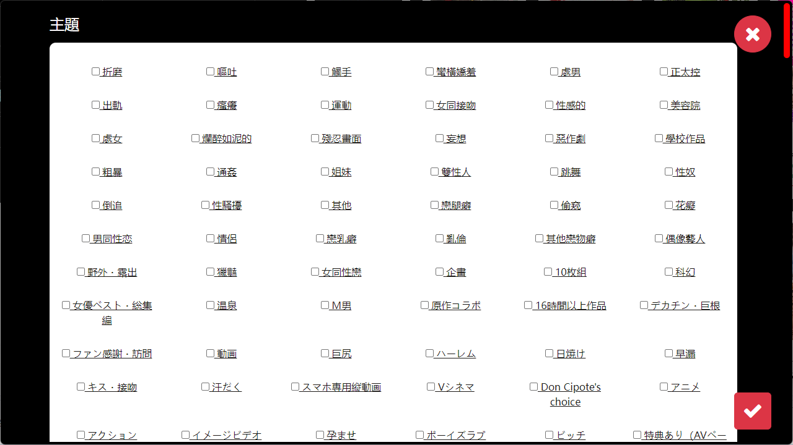
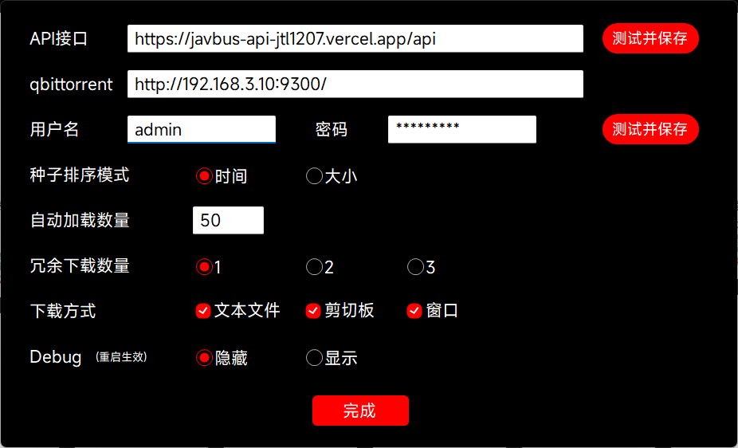

#  JavBusDownloader
JavBus 种子批量下载工具  
基于[JavBus API](https://github.com/ovnrain/javbus-api) 制作
### [下载地址](https://github.com/jtl1207/JavBusDownloader/releases)
# 部署与启动
使用前请确保网络正常,可以访问API接口与JavBus(加载图片)
[更多部署说明](https://github.com/ovnrain/javbus-api) 
#### Docker 部署（推荐）

[Docker Hub 地址](https://hub.docker.com/r/ovnrain/javbus-api)

```shell
$ docker pull ovnrain/javbus-api
$ docker run -d \
    --name=javbus-api \
    --restart=unless-stopped \
    -p 8922:3000 \
    ovnrain/javbus-api
```
#### Vercel 部署
- 无需额外硬件
- 公网访问，即开即用
- 性能低下 , 获取信息速度慢

点击下方按钮，即可将本项目一键部署到 Vercel 上

[](https://vercel.com/new/clone?repository-url=https%3A%2F%2Fgithub.com%2Fovnrain%2Fjavbus-api&project-name=javbus-api&repository-name=javbus-api-from-ovnrain)
# 参数说明
##### API接口:  
上方部署完成的链接  
##### qbittorrent接口:
qbittorrent的Web登录页面

## 图片



